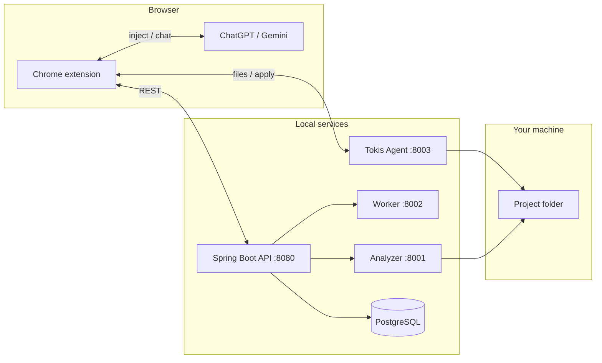

# Tokis

> **Tagline:** A privacy-aware developer bridge between your local repository and ChatGPT—inject context, mask sensitive paths, review AI-suggested edits, and apply changes only after you approve.

<p align="center">
  <strong>Local code stays local. The model sees what you allow. Your disk updates only when you say so.</strong>
</p>

Tokis is a Chrome extension and local service stack that connects a real project on disk to ChatGPT or Gemini. You select files from your repo, optionally mask paths as reversible tokens (`MASK1`, `MASK2`), send structured context to the model, parse its `tokis-edit` suggestions, and write approved files through a local agent—nothing touches your repository until you confirm in **Review suggestions**.

Built for teams that need LLM productivity without giving up control, path privacy, or a clear audit trail of what was applied.

---

## Demo

**[Watch the demo on YouTube →](https://youtu.be/hiu95gZ69_w)** 

A short walkthrough of the full workflow on the included `tokis-test` sample repo:

| Step | What you will see |
|------|-------------------|
| 1 | Connect a local repository via the Tokis FAB |
| 2 | **Inject prompt** — select files, preview, mask sensitive paths as `MASK1` / `MASK2` |
| 3 | ChatGPT proposes fixes using `tokis-edit:MASKn` (no guessed paths exposed to the model) |
| 4 | **Review suggestions** — demask paths, preview real file content, approve selected writes |
| 5 | Changes applied only to the correct files on disk (approve-before-write) |

**Written walkthrough:** [tokis-test/TESTING.md](tokis-test/TESTING.md) · **Sample repo:** [`tokis-test/`](tokis-test/)

> **For recruiters:** Tokis does not auto-write to your codebase. The extension bridges ChatGPT and a local repo; masking keeps internal paths off the wire until you approve apply on your machine.

---

> **GitHub About (short description):** Privacy-aware ChatGPT workflow for local repos—inject context, mask paths, review AI edits, approve before write.

---
## Why Tokis exists

| Problem | How Tokis addresses it |
|--------|-------------------------|
| Pasting code into ChatGPT exposes paths, keys, and internal structure | Preview-time **path masking** with tokens; real values restored only on your machine at review |
| No structured apply flow from model replies | Parses `tokis-edit` blocks → **Review suggestions** → approve → writes via local agent |
| Upload limits / no repo awareness | **Inject prompt** resolves indexed files; **Inject file** for local files; no cloud upload required |
| Model claims “I updated your files” | `.tokis/protocol.md` + approve gate; disk changes only after you click **Approve selected** |

---

## Architecture



| Component | Port | Role |
|-----------|------|------|
| **tokis-extension** | — | FAB UI: connect repo, inject, mask, review, apply |
| **tokis** (Spring Boot) | 8080 | Repos, file index, resolve snippets, mask vault API |
| **tokis-agent** | 8003 | Folder picker, read/write/apply files on disk |
| **worker** | 8002 | Query → relevant file snippets |
| **analyzer** | 8001 | Ingest repo file list for indexing |
| **PostgreSQL** | 5432 | Repo metadata, file nodes, mask references |

---

## Key features

- **Connect repository** — Pick a folder via native dialog; ingest file index into Tokis.
- **Inject prompt** — Select files, preview, mask paths (`MASK1`), inject into the chat composer.
- **Inject file** — Attach arbitrary local text files with the same preview/mask flow.
- **Review suggestions** — Parse model `tokis-edit` output; demask paths; preview real content; apply to disk.
- **Privacy-aware masking** — Mask paths in preview; LLM sees tokens; Tokis resolves real paths before write (blocks `MASK*.java` mistaken paths).
- **Repository management** — List, connect, delete indexed repos (disk files are never deleted).

---

## Tech stack

- **Frontend:** Chrome Extension (Manifest V3), vanilla JS
- **API:** Java 17+, Spring Boot, JPA, PostgreSQL
- **Agents / ML helpers:** Python, FastAPI, Uvicorn
- **Integration:** ChatGPT, Gemini (content scripts)

---

## Prerequisites

- **Chrome** (or Chromium) for the extension
- **Java 17+** and Maven (or use `tokis/tokis/mvnw`)
- **Python 3.10+**
- **PostgreSQL** running locally with database `tokis` (see `application.yml`)
- **Windows / macOS / Linux** — folder picker agent tested on Windows; paths supported cross-platform

---

## Quick start

### 1. Database

Create PostgreSQL database `tokis` (user/password as in `tokis/tokis/src/main/resources/application.yml` or override).

### 2. Start services (four terminals)

```bash
# Terminal 1 — Analyzer
cd analyzer/app
uvicorn main:app --reload --port 8001

# Terminal 2 — Worker (from worker/)
cd worker
uvicorn app.main:app --reload --port 8002

# Terminal 3 — Spring API
cd tokis/tokis
./mvnw spring-boot:run

# Terminal 4 — Tokis Agent
cd tokis-agent/app
uvicorn main:app --reload --port 8003
```

On Windows PowerShell, use `.\mvnw` and ensure each app module is on `PYTHONPATH` if imports fail (run from the paths shown above).

### 3. Load the extension

1. Open `chrome://extensions`
2. Enable **Developer mode**
3. **Load unpacked** → select the `tokis-extension` folder
4. Open [ChatGPT](https://chatgpt.com) or [Gemini](https://gemini.google.com)

### 4. Connect the demo repo

1. Click the **Tokis** FAB → **Add Project**
2. Select the `tokis-test` folder from this repository
3. In chat, type a task (see demo script below)

---

## Demo repo (`tokis-test`)

Intentionally buggy sample project for recordings and interviews.

| File | Issue |
|------|--------|
| `src/Calculator.java` | Divide by zero; `greet(null)` NPE |
| `src/helper.py` | `=` instead of `==` in `find_user`; `average([])` crashes |
| `config.js` | Mixed ESM/CommonJS; typo in export name |
| `logs/build.log` | Sample CI log (useful for path-masking demos) |

**Verify bugs locally (before Tokis fix):**

```bash
cd tokis-test

# Python — expect SyntaxError until helper.py is fixed
python demo_check.py

# Java
mkdir -p out 2>nul || mkdir out
javac -d out demo_check.java src/Calculator.java
java -cp out demo_check
```

**Suggested ChatGPT prompt after inject** (mask `---path---` headers first, then inject):

```text
Fix the bugs in the injected files. Use tokis-edit with the same MASK tokens as the headers (e.g. tokis-edit:MASK1). Do not claim files were written until I approve in Tokis.
```

End-to-end flow (connect → inject → mask → review → apply): [tokis-test/TESTING.md](tokis-test/TESTING.md).

---

## Security & privacy notes

- Mask placeholders are stored locally (extension + optional Spring `mask_reference` table) and **demasked only on review/apply** on your machine.
- Tokis does not send chat traffic to Microsoft or OpenAI servers—only you interact with the LLM in the browser.
- Sensitive files (e.g. `.env`) should stay **unchecked** on inject; mask only what you must share.
- Apply endpoint rejects file paths that still contain unresolved `MASK` tokens.

---

## Project structure

```
Tokis_V1/
├── tokis-extension/     # Chrome extension (FAB, inject, mask, review)
├── tokis/tokis/         # Spring Boot API
├── tokis-agent/         # Local file I/O + folder picker
├── worker/              # Snippet retrieval for queries
├── analyzer/            # Repo ingest
└── tokis-test/          # Demo project with intentional bugs
```

---

## Future roadmap

Tokis today is intentionally focused: connect a repo, inject with masking, review, and approve writes. Below is where the product is headed—not a commitment timeline, but the direction that would make it competitive with IDE-native AI tools while keeping the privacy and approval model.

### Planned direction (your vision)

| Initiative | What it would mean |
|------------|-------------------|
| **Cursor-style conversation loop** | Multi-turn workflow inside Tokis: each model reply can trigger follow-up inject, refined context, or partial apply without starting over. Session state would tie together chat turns, active mask sets, and “what changed on disk since turn N.” |
| **Contextual dependency graph** | Index symbols (functions, classes, imports) and edges (calls, extends, imports) across files. UI to explore “what depends on this?” and auto-select related files/snippets for inject—so context is structural, not only keyword search. |

### Additional directions worth considering

These are suggestions that fit the same architecture; none are built yet.

- **Smarter context selection** — When you `@` a symbol or file, Tokis proposes a *bundle* (callers, callees, tests, config) ranked by relevance, with one-click add to the inject preview.
- **Symbol-aware masking** — Mask a module path or package name once; demask consistently in paths, imports, and string literals on review (extends today’s `MASK1` path tokens).
- **Diff-first review** — Show unified diffs per file before apply, not only full-file previews—easier to audit model output at scale.
- **Terminal bridge (`tokis-run`)** — Propose shell commands in chat; run locally only after explicit approval (pairs well with path masking in logs).
- **IDE sidebar (VS Code / Cursor)** — Same protocol (`.tokis/protocol.md`, `tokis-edit`, mask vault) without relying on the browser composer.
- **Team policy layer** — Shared rules for what must be masked, optional audit log of inject/apply events for compliance reviews.

If you are evaluating this for a role: the near-term bet is **trust + structure** (mask, approve, real paths)—the longer-term bet is **context quality** (graph + loop) so developers do not have to manually guess which files belong in the prompt.

---

## Author

**Shreyansh Karamtot**

- **Demo:** [YouTube walkthrough](https://youtu.be/hiu95gZ69_w)
- **Focus:** Trust, privacy, and developer control when using public LLMs on private codebases—the same constraints teams at scale care about.

---

